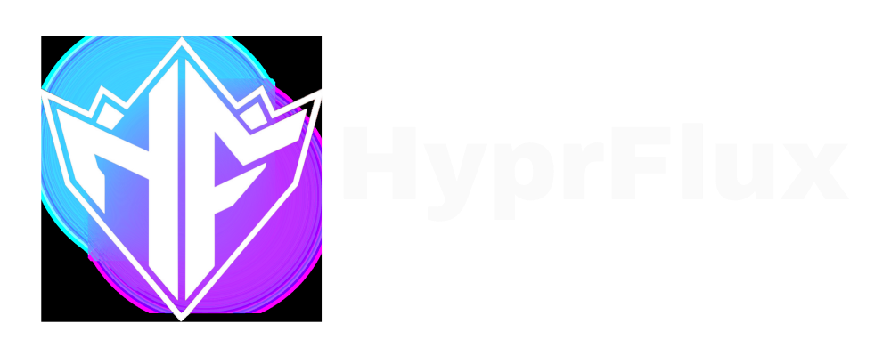
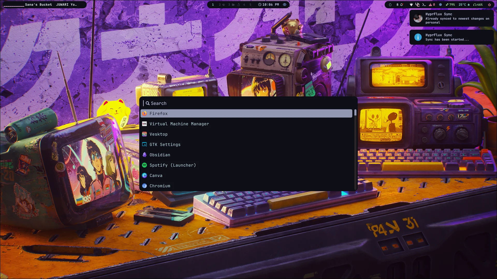
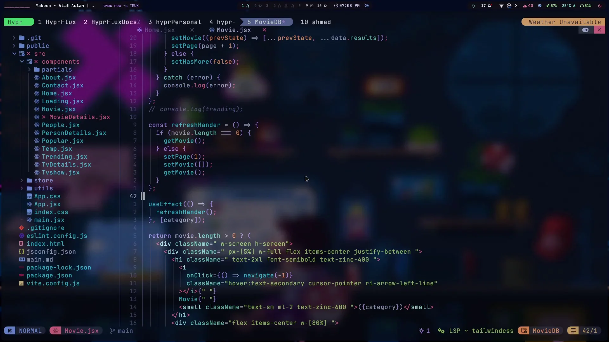
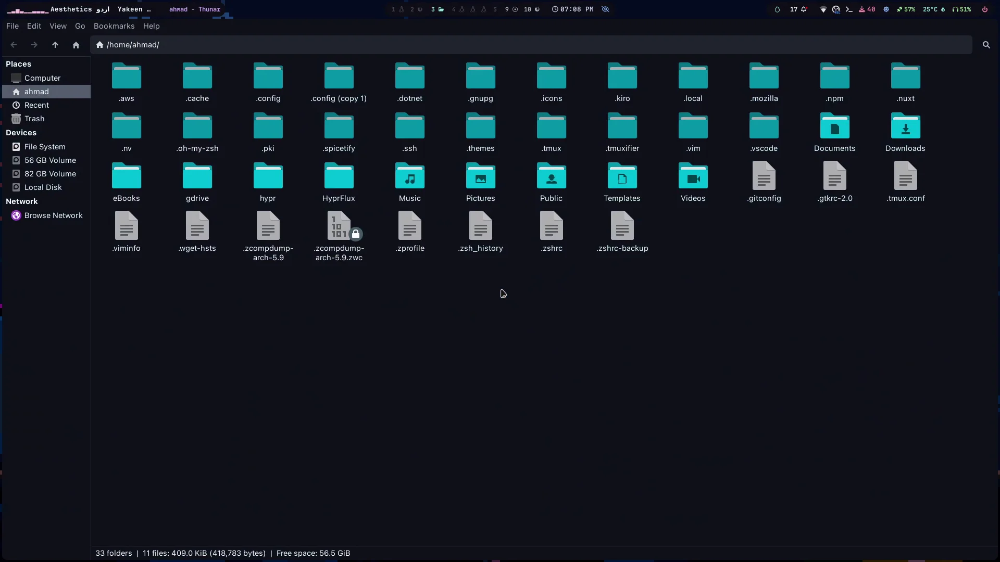

<div align="center">



<br/>
<br/>

[](https://opensource.org/licenses/MIT)
[](https://archlinux.org/)
[](https://hyprland.org/)
[](https://www.gnu.org/software/bash/)
[](https://github.com/ahmad9059/HyprFlux/stargazers)
[](https://github.com/ahmad9059/HyprFlux/network/members)

<br/>

*HyprFlux is a complete Arch Linux desktop platform built around Hyprland -*
*installer, boot experience, login flow, theming, tooling, and maintained dotfiles in one project.*

<br/>

[Quick Install](#quick-installation) &nbsp;•&nbsp; [Screenshots](#screenshots) &nbsp;•&nbsp; [Features](#features) &nbsp;•&nbsp; [Project Scope](#project-scope) &nbsp;•&nbsp; [Documentation](https://hyprflux.dev/general/installation) &nbsp;•&nbsp; [Contributing](#contributing)

</div>

---

## Overview

HyprFlux started as a dotfiles distribution and has grown into a complete Arch Linux desktop operating system project. It does not just drop configs into `~/.config` - it builds a branded Hyprland system experience with automated setup, curated packages, GTK theming, boot theming, login theming, wallpapers, developer tooling, and maintained desktop defaults.

Today, HyprFlux covers two layers of the stack:

- the **desktop platform layer**: installer flow, package setup, SDDM, GRUB, Plymouth, cursors, themes, wallpapers, utilities, and system defaults
- the **dotfiles distribution layer**: Hyprland, Waybar, Rofi, Kitty, Zsh, Tmux, Neovim, scripts, keybinds, and workflow customization

The goal is simple: start from a fresh Arch installation and end up with a polished, consistent, production-ready Hyprland system without piecing everything together manually.

## Project Scope

HyprFlux is not just a theme pack and not just a dotfiles dump.

It is designed as a complete operating system experience on top of Arch Linux, including:

- a reproducible install flow
- a branded boot pipeline from GRUB to Plymouth to SDDM
- a maintained Hyprland desktop configuration
- curated applications and developer tools
- opinionated defaults with room for customization

If you only want the configs, HyprFlux still works as a maintained dotfiles distribution.
If you want the full platform, HyprFlux also delivers the surrounding operating-system-level setup that makes the desktop feel cohesive from power-on to login to daily use.

## Screenshots

<div align="center">

### Desktop Overview


|  |  |
| ------------------- | ------------------- |
|  |  |
|  |  |

</div>

## Features

### Platform Features

- **Automated install flow**: modular setup with sane defaults and minimal manual work
- **Custom boot experience**: branded GRUB, Plymouth, and SDDM integration
- **System theming**: GTK, icons, cursors, wallpapers, and desktop-wide visual consistency
- **Hardware-aware setup**: monitor configuration, cursor setup, theme wiring, and post-install scripts

### Desktop Features

- **[Hyprland](https://hyprland.org/)** with maintained configs and workflow-oriented defaults
- **[Waybar](https://github.com/Alexays/Waybar)** with curated layouts and custom modules
- **[Rofi](https://github.com/davatorium/rofi)** for launching, switching, searching, and custom menus
- **[SDDM](https://github.com/sddm/sddm)** with a HyprFlux-branded login theme

### Developer Features

- **[Neovim](https://neovim.io/)** with a separate maintained config
- **[Tmux](https://github.com/tmux/tmux)** and **[Zsh](https://www.zsh.org/)** preconfigured for daily work
- **AI tooling support** via AUR packages such as Claude Code, OpenAI Codex, Gemini CLI, and OpenCode
- **Web apps and utilities** pre-integrated for modern workflows

### Design Direction

- **HyprFlux identity**: custom logos, boot branding, and consistent naming across the project
- **Deep, modern aesthetic**: purple-led accent system, dark UI, and cohesive defaults
- **Practical customization**: easy to swap wallpapers, layouts, profiles, themes, and scripts

## Requirements

### System Requirements

- **Base**: Arch Linux
- **Architecture**: `x86_64`
- **Memory**: 4 GB minimum, 8 GB+ recommended
- **Storage**: 10 GB minimum free space
- **Network**: active internet connection for package installation

### Recommended Starting Point

- fresh Arch Linux installation
- working internet connection
- user account with `sudo` privileges
- basic tools available: `curl`, `git`, `sudo`

## Quick Installation

### One-Line Install

```bash
sh <(curl -fsSL https://hyprflux.dev/install)
```

### What the installer does

- installs required packages and desktop components
- applies HyprFlux dotfiles and user configuration
- configures themes, cursors, wallpapers, and startup behavior
- sets up branded boot and login pieces where enabled
- prepares a usable Hyprland desktop without manual post-install patching

> **Important**
> HyprFlux changes system and user configuration. Use it on a fresh Arch setup or make backups before applying it to an existing environment.

## Post-Installation

After installation completes:

1. reboot the machine if the installer requests it
2. log in through SDDM
3. let the first-boot steps finish
4. start customizing from the shipped configs and scripts

Useful locations:

- **Configs**: `~/.config/`
- **Themes**: `~/.themes/`
- **Icons and cursors**: `~/.icons/`
- **Wallpapers**: `~/Pictures/wallpapers/`
- **Backup**: `~/dotfiles_backup/`

## Repository Layout

```text
HyprFlux/
├── config/          # Project configuration files
├── dotsSetup.sh     # Main modular dotfiles/platform setup entrypoint
├── install.sh       # Primary install entrypoint
├── lib/             # Shared install helpers
├── modules/         # Modular install and setup steps
├── review/          # Screenshots and branding assets for the repo
├── scripts/         # Installer helper scripts and automation patches
├── utilities/       # Themes, archives, logos, cursors, boot assets
└── .config/         # Maintained HyprFlux desktop config layer
```

## Core Components

- `install.sh` - top-level install entrypoint
- `dotsSetup.sh` - orchestrates the modular setup flow
- `modules/` - feature-specific setup units such as GTK, SDDM, Plymouth, cursors, AI tools, and monitors
- `.config/hypr/` - Hyprland configs, scripts, monitor profiles, and user overrides
- `.config/waybar/` - layouts, modules, and styling
- `.config/rofi/` - launcher and menu themes
- `.themes/HyprFlux-Compact/` - HyprFlux GTK theme
- `utilities/` - bundled assets used during installation

## Documentation

- Website: [https://hyprflux.dev](https://hyprflux.dev)
- Installation docs: [https://hyprflux.dev/general/installation](https://hyprflux.dev/general/installation)
- Issues: [https://github.com/ahmad9059/HyprFlux/issues](https://github.com/ahmad9059/HyprFlux/issues)

## Contributing

Contributions are welcome.

You can help by:

- reporting bugs with logs, screenshots, and reproduction steps
- proposing platform improvements or desktop workflow ideas
- improving installer reliability across more hardware setups
- refining themes, layouts, branding, or documentation
- sending pull requests for focused, well-tested changes

If you are making a larger change, open an issue first so the direction stays aligned with the project.

## License

This project is licensed under the MIT License. See [`LICENSE`](LICENSE).

## Acknowledgments

- **[JaKooLit](https://github.com/JaKooLit)** - for the original foundation that HyprFlux grew from
- **Hyprland community** - for the compositor and surrounding ecosystem
- **Arch Linux** - for the base system that makes this possible
- **Open source maintainers** - for the tools, themes, packages, and workflows HyprFlux builds on

## Project Stats


---

<div align="center">

**Built and maintained by [ahmad9059](https://github.com/ahmad9059)**

**If HyprFlux helped you, consider starring the repository.**

</div>
